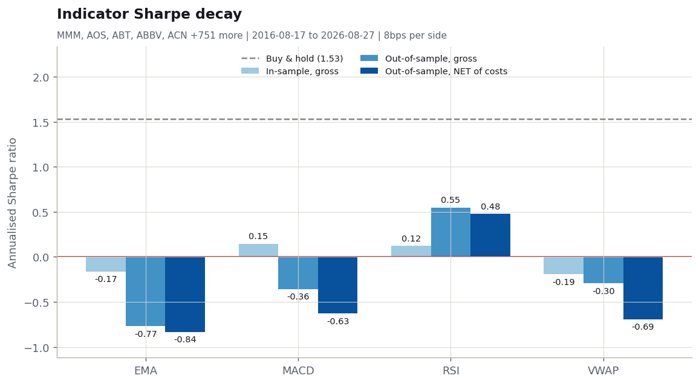
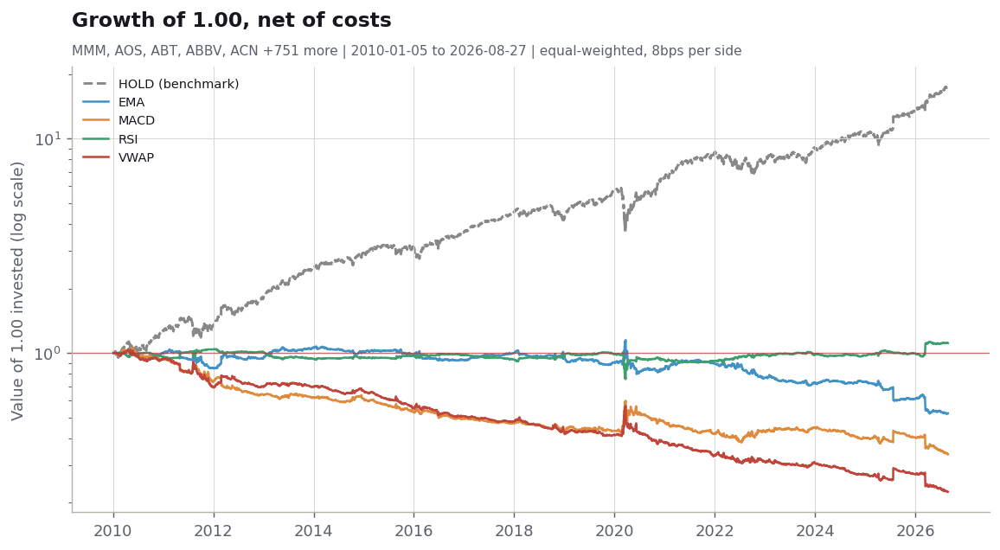
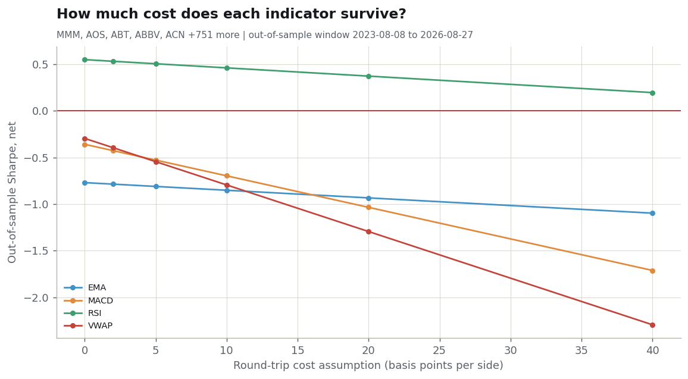

# Margin & Co. — Week 3

*Testing whether popular retail trading indicators survive realistic trading costs.*

**Universe:** MMM, AOS, ABT, ABBV, ACN, ADBE, AMD, AES, AFL, A, APD, AKAM, ALB, ARE, ALGN, ALLE, LNT, ALL, GOOGL, GOOG, MO, AMZN, AMCR, AEE, AEP, AXP, AIG, AWK, AMP, AME, AMGN, APH, ADI, AON, APA, APO, AAPL, AMAT, APTV, ACGL, ADM, ARES, ANET, AJG, AIZ, T, ATO, ADSK, ADP, AZO, AVY, AXON, BKR, BALL, BAC, BAX, BDX, BRK-B, BBY, TECH, BIIB, BLK, BX, XYZ, BNY, BA, BKNG, BSX, BMY, AVGO, BR, BRO, BF-B, BLDR, BG, BXP, CHRW, CDNS, CPT, COF, CAH, CCL, CASY, CAT, CBOE, CBRE, CDW, COR, CNC, CNP, CF, CRL, SCHW, CHTR, CVX, CMG, CB, CHD, CIEN, CI, CINF, CTAS, CSCO, C, CFG, CLX, CME, CMS, KO, CTSH, COHR, CL, CMCSA, FIX, COP, ED, STZ, COO, CPRT, GLW, CPAY, CSGP, COST, CRH, CCI, CSX, CMI, CVS, DHR, DRI, DVA, DE, DELL, DAL, DVN, DXCM, FANG, DLR, DG, DLTR, D, DPZ, DOV, DHI, DTE, DUK, DD, ETN, EBAY, ECHO, ECL, EIX, EW, ELV, EME, EMR, ETR, EOG, EQT, EFX, EQIX, ERIE, ESS, EL, EG, EVRG, ES, EXC, EXPE, EXPD, EXR, XOM, FFIV, FDS, FICO, FAST, FRT, FDX, FERG, FIS, FITB, FSLR, FE, FISV, FLEX, F, FTNT, FTV, BEN, FCX, GRMN, IT, GE, GEN, GNRC, GD, GIS, GM, GPC, GILD, GPN, GL, GDDY, GS, HAL, HIG, HAS, HCA, DOC, HSIC, HSY, HPE, HLT, HD, HON, HRL, HST, HPQ, HUBB, HUM, HBAN, HII, IBM, IEX, IDXX, ITW, INCY, PODD, INTC, IBKR, ICE, IFF, IP, INTU, ISRG, IVZ, IQV, IRM, JBHT, JBL, JKHY, J, JNJ, JCI, JPM, KDP, KEY, KEYS, KMB, KIM, KMI, KKR, KLAC, KHC, KR, LHX, LH, LRCX, LVS, LDOS, LEN, LII, LLY, LIN, LYV, LMT, L, LULU, LITE, LYB, MTB, MPC, MAR, MRSH, MLM, MRVL, MAS, MA, MKC, MCD, MCK, MDT, MRK, META, MET, MTD, MGM, MCHP, MU, MSFT, MAA, TAP, MDLZ, MPWR, MNST, MCO, MS, MOS, MSI, MSCI, NDAQ, NTAP, NFLX, NEM, NWSA, NWS, NEE, NKE, NI, NDSN, NSC, NTRS, NOC, NCLH, NRG, NUE, NVDA, NVR, NXPI, ORLY, OXY, ODFL, OMC, ON, OKE, ORCL, PCAR, PKG, PANW, PSKY, PH, PYPL, PNR, PEP, PFE, PCG, PM, PSX, PNW, PNC, PPG, PPL, PFG, PG, PGR, PLD, PRU, PEG, PTC, PSA, PHM, PWR, QCOM, DGX, RL, RJF, RTX, O, REG, REGN, RF, RSG, RMD, RVTY, ROK, ROL, ROP, ROST, RCL, SPGI, CRM, SBAC, SLB, STX, SRE, NOW, SHW, SPG, SWKS, SJM, SW, SNA, SO, LUV, SWK, SBUX, STT, STLD, STE, SYK, SMCI, SYF, SNPS, SYY, TMUS, TROW, TTWO, TPR, TRGP, TGT, TEL, TDY, TER, TSLA, TXN, TPL, TXT, TMO, TJX, TKO, TSCO, TT, TDG, TRV, TRMB, TFC, TYL, TSN, USB, UDR, ULTA, UNP, UAL, UPS, URI, UNH, UHS, VLO, VEEV, VTR, VRSN, VRSK, VZ, VRTX, VTRS, V, VMC, WRB, GWW, WAB, WMT, DIS, WBD, WM, WAT, WEC, WFC, WELL, WST, WDC, WY, WSM, WMB, WTW, WDAY, WYNN, XEL, XYL, YUM, ZBRA, ZBH, ZTS, III.L, ABDN.L, ADM.L, ALW.L, AAL.L, ANTO.L, ABF.L, AZN.L, AUTO.L, AV.L, BAB.L, BA.L, BARC.L, BTRW.L, BEZ.L, BP.L, BATS.L, BLND.L, BT-A.L, BNZL.L, BRBY.L, CNA.L, CCH.L, CPG.L, CCC.L, CRDA.L, DCC.L, DGE.L, DPLM.L, ENT.L, EXPN.L, FCIT.L, FRES.L, GAW.L, GSK.L, HLMA.L, HSX.L, HWDN.L, HSBA.L, ICG.L, IGG.L, IHG.L, IMI.L, IMB.L, INF.L, IAG.L, ITRK.L, INVP.L, JD.L, BGEO.L, KGF.L, LAND.L, LGEN.L, LLOY.L, LMP.L, LSEG.L, MKS.L, MRO.L, NG.L, NWG.L, NXT.L, PSON.L, PSN.L, PCT.L, PRU.L, RKT.L, REL.L, RTO.L, RIO.L, RR.L, SGE.L, SBRY.L, SDR.L, SMT.L, SGRO.L, SVT.L, SHEL.L, SMIN.L, SN.L, SPX.L, SSE.L, STAN.L, SDLF.L, STJ.L, TSCO.L, BBOX.L, ULVR.L, UU.L, VOD.L, WEIR.L, WTB.L, FOUR.L, AAS.L, ASL.L, AEP.L, AO.L, ASHM.L, ATYM.L, AGT.L, AVON.L, BME.L, BGFD.L, BBY.L, BNKR.L, BAG.L, BWY.L, BKG.L, BHMG.L, BYG.L, BRGE.L, BRSC.L, BRWM.L, BMY.L, BOY.L, BREE.L, BUT.L, CLDN.L, CGT.L, CWR.L, CHG.L, CSN.L, CTY.L, CKN.L, CBG.L, CMCX.L, COA.L, COST.L, CWK.L, CURY.L, CVSG.L, DLN.L, DSCV.L, DOM.L, DRX.L, DNLM.L, EZJ.L, EDIN.L, EWI.L, ELM.L, ESCT.L, FCSS.L, FEML.L, FEV.L, FSV.L, FGT.L, FGP.L, FGEN.L, FRAS.L, GFRD.L, GAMA.L, GBG.L, GCP.L, GEN.L, GNS.L, DATA.L, GSCT.L, GDWN.L, GFTU.L, GRI.L, GPE.L, UKW.L, GNC.L, GRG.L, HFD.L, HMSO.L, HANA.L, HVPE.L, HWG.L, HAS.L, HFEL.L, HSL.L, HRI.L, HGT.L, HICL.L, HIK.L, HILS.L, HFG.L, HOC.L, HTG.L, ICGT.L, INCH.L, INPP.L, IWG.L, IAD.L, IPO.L, ITV.L, JMAT.L, JSG.L, JAM.L, JCH.L, JEMI.L, JMGI.L, JEDT.L, JEGI.L, JGGI.L, JFJ.L, JUP.L, KNOS.L, KLR.L, KIE.L, LRE.L, LWDB.L, EMG.L, MEGP.L, MRC.L, MRCH.L, MTRO.L, MTO.L, GROW.L, MNDI.L, MNKS.L, MONY.L, MGAM.L, MGNS.L, MUT.L, MYI.L, NBPE.L, NCC.L, NAIT.L, NAS.L, OCI.L, OCDO.L, OSB.L, OXB.L, OXIG.L, PHI.L, PAGE.L, PAF.L, PIN.L, PAG.L, PEY.L, PPET.L, PNN.L, PNL.L, PETS.L, PTEC.L, PLUS.L, PCGH.L, POLN.L, PPH.L, PFD.L, PHP.L, QQ.L, RNK.L, RAT.L, RSW.L, RMV.L, RCP.L, ROR.L, RICA.L, SAFE.L, SAGA.L, SVS.L, ATR.L, SDP.L, SOI.L, SAIN.L, SNR.L, SEQI.L, SRP.L, SHC.L, SRE.L, SCT.L, SPI.L, SSPG.L, SYNC.L, THRL.L, TATE.L, TW.L, TBCG.L, TEP.L, TMPL.L, TEM.L, TRIG.L, TCAP.L, TPK.L, TRY.L, TFIF.L, UTG.L, UEM.L, VSVS.L, VCT.L, VEIL.L, VOF.L, VTY.L, FAN.L, JDW.L, SMWH.L, WIZZ.L, WKP.L, WWH.L, WPP.L, XPP.L, ZIG.L  
**Period:** 2016-08-17 to 2026-08-27  
**Validation:** 70/30 split, plus 6 walk-forward windows  
**Cost assumption:** 8 bps per side (5 spread + 1 commission + 2 slippage)

---

## The bottom line

Of 4 indicators tested, **none beat buy & hold out-of-sample after costs.**

EMA, MACD, VWAP produced a zero or negative Sharpe once costs were applied — meaning the strategy would have lost money net of what it cost to trade it.

Buy & hold, the benchmark, returned a Sharpe of **1.53** over the same out-of-sample window.

## The decay curve

*Left bar: what the indicator looked like on the data used to design it. Middle bar: the same rule on data it had never seen. Right bar: after paying to trade. The gap between the first and last bar is the number retail backtests do not show you.*

## Results

| Indicator | In-sample Sharpe (gross) | Out-of-sample Sharpe (gross) | Out-of-sample Sharpe (net) | Trades | Cost paid | Max drawdown | Win rate | Verdict |
|---|---:|---:|---:|---:|---:|---:|---:|:---:|
| EMA | -0.17 | -0.77 | -0.84 | 59,951 | 12.6% | -30.8% | 51.3% | FAILED |
| MACD | 0.15 | -0.36 | -0.63 | 247,525 | 52.3% | -25.6% | 43.0% | FAILED |
| RSI | 0.12 | 0.55 | 0.48 | 85,982 | 9.4% | -6.4% | 45.9% | WEAKENED |
| VWAP | -0.19 | -0.30 | -0.69 | 375,820 | 79.4% | -27.5% | 44.0% | FAILED |
| *Buy & hold* | 0.85 | 1.53 | 1.53 | 0 | 0.1% | -14.3% | — | *benchmark* |

- **SURVIVED** — positive out-of-sample Sharpe after costs, AND beat buy & hold
- **WEAKENED** — still positive after costs out-of-sample, but lost to buy & hold
- **FAILED** — out-of-sample Sharpe was zero or negative once costs were applied

## What happened, indicator by indicator

### EMA — FAILED

*Trend-following: long while the 20-day EMA is above the 50-day EMA.*

**EMA** posted a -0.17 Sharpe in-sample, -0.77 out-of-sample, and -0.84 once trading costs were applied (59,951 trades, 12.6% of notional paid away).

### MACD — FAILED

*Trend-following: long while the MACD line (EMA12-EMA26) is above its 9-day signal line.*

**MACD** posted a 0.15 Sharpe in-sample, -0.36 out-of-sample, and -0.63 once trading costs were applied (247,525 trades, 52.3% of notional paid away).

### RSI — WEAKENED

*Mean-reversion: buy below RSI 30, short above RSI 70, flatten back at 50.*

**RSI** posted a 0.12 Sharpe in-sample, 0.55 out-of-sample, and 0.48 once trading costs were applied (85,982 trades, 9.4% of notional paid away).

### VWAP — FAILED

*Trend-following: long while the close is above the 20-day rolling volume-weighted average price.*

**VWAP** posted a -0.19 Sharpe in-sample, -0.30 out-of-sample, and -0.69 once trading costs were applied (375,820 trades, 79.4% of notional paid away).

## Walk-forward check

One 70/30 split gives one reading, and one reading can be luck. Below, each indicator is re-tested across rolling three-year training windows with the following year held out — many independent out-of-sample readings instead of one.

| Indicator | Windows | Mean OOS Sharpe (net) | Windows positive | Worst window |
|---|---:|---:|---:|---:|
| EMA | 6 | -0.44 | 16.7% | -1.51 |
| MACD | 6 | -0.40 | 50.0% | -2.09 |
| RSI | 6 | 0.13 | 50.0% | -0.65 |
| VWAP | 6 | -0.89 | 16.7% | -2.00 |

## Growth of 1.00, net of costs

## How wrong could the cost assumption be?

*Where each line crosses zero is the highest trading cost that indicator could tolerate and still break even.*

## Method

1. Daily split- and dividend-adjusted bars from Yahoo Finance.
2. Each indicator emits a target position of +1 (long), 0 (flat), or -1 (short).
3. **Positions are shifted forward one day before returns are applied.** A signal computed from Monday's close can only be traded at Monday's close, so the first return it can earn is Monday-to-Tuesday. Skipping this step is the most common backtest bug and typically adds one to three points of Sharpe that do not exist.
4. Costs are charged on turnover: cost = |change in position| × 8 bps. A long-to-short flip pays twice.
5. The training period is used to design and sanity-check the rules. The test period is measured once.

## Limitations

Stated every week, because they do not go away:

- **Survivorship bias.** The universe uses *current* index membership. Companies that were delisted or dropped from the index are absent, which flatters absolute returns. The in-sample versus out-of-sample *comparison* is affected much less, since both halves share the bias.
- **One cost assumption, applied uniformly.** Real spreads vary by stock, by day, and widen exactly when you most want to trade. The sensitivity chart is the honest response to this.
- **No position sizing, leverage, or risk limits.** Every position is the same size. Real execution would size by volatility.
- **Daily bars only.** Intraday signals cannot be evaluated here — in particular, true VWAP is an intraday measure and what is tested here is a rolling volume-weighted moving average. That is a different thing and is labelled as such.
- **Long/short with no borrow cost.** Shorting is assumed free. It is not.

---

*Generated 2026-08-27 by the Margin & Co. pipeline. Code and data are open: every number above can be reproduced by running `python run_pipeline.py`.*